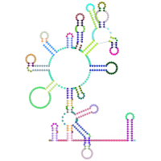
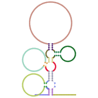
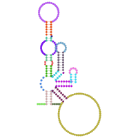
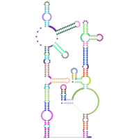
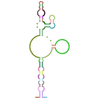
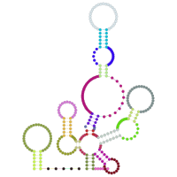

# Rfam for RNArtist

|<!-- -->|<!-- --> |<!-- --> |<!-- --> |<!-- --> |
|:--:|:--:|:--:|:--:|:--:|
|<br/>[RF00503](https://rfam.xfam.org/family/RF00503)|<br/>[RF01294](https://rfam.xfam.org/family/RF01294)|<br/>[RF01512](https://rfam.xfam.org/family/RF01512)|<br/>[RF01852](https://rfam.xfam.org/family/RF01852)|<br/>[RF00379](https://rfam.xfam.org/family/RF00379)|
|<br/>[RF00168](https://rfam.xfam.org/family/RF00168)|<br/>[RF01999](https://rfam.xfam.org/family/RF01999)|<br/>[RF02374](https://rfam.xfam.org/family/RF02374)|<br/>[RF02561](https://rfam.xfam.org/family/RF02561)|<br/>[RF01469](https://rfam.xfam.org/family/RF01469)|
|<br/>[RF00380](https://rfam.xfam.org/family/RF00380)|<br/>[RF02599](https://rfam.xfam.org/family/RF02599)|<br/>[RF02762](https://rfam.xfam.org/family/RF02762)|<br/>[RF03018](https://rfam.xfam.org/family/RF03018)|<br/>[RF01745](https://rfam.xfam.org/family/RF01745)|

This project provides curated secondary structures for all the RNA families available from [the Rfam database](https://rfam.xfam.org/) (more than 4,000 families in Rfam 14.7). Upcoming updates for this project will provide curated layout for families whose first draft is not satifying.

For each family, you will find two files:
* rnartist.kts: this script provides the instructions to plot the consensus structure of the RNA family. It is written with the [RNArtistCore language](https://github.com/fjossinet/RNArtistCore) and has to be used with the graphical tool [RNArtist](https://github.com/fjossinet/RNArtist) or the library [RNArtistCore](https://github.com/fjossinet/RNArtistCore)
* preview.png: a PNG picture showing how the consensus structure will look like if you run the script rnartist.kts with [RNArtist](https://github.com/fjossinet/RNArtist) or [RNArtistCore](https://github.com/fjossinet/RNArtistCore).

The script rnartist.kts defines the layout and the colors for the consensus structure of the RNA family. A random color has been chosen for each structural domain (helices, junctions). You can modify this script to apply the same layout and colors to a single RNA or to all RNAs in the family.

## How to use these data?

You hve to modify the script rnartist.kts to fit your needs. You can change the colors, the theme, choose to export the result in an SVG or PNG file (see the [RNArtistCore language documentation](https://github.com/fjossinet/RNArtistCore) for details). Then you need to run this script with a tool that can understand the RNArtistCore language.

### With the graphical tool [RNArtist](https://github.com/fjossinet/RNArtist)

RNArtist provides a script editor that allows you to more easily modify the script, to preview and to interact with the resulting plot. 

In the script editor, choose "Load Script -> New Script -> 2D from Databases -> Rfam DB". You will be prompted to choose an Rfam ID. RNArtist will then retrieve the last version of the script rnartist.kts stored in this project.

You could also browse and preview all the families interactively from within RNArtist. To do so, you need to:
* [download this project on your computer](https://github.com/fjossinet/Rfam-for-RNArtist/archive/refs/heads/main.zip)
* in the Settings of RNArtist, define the data subdirectory of this project as your "Projects Folder"


### With the library [RNArtistCore](https://github.com/fjossinet/RNArtistCore)

This library is one of the components making RNArtist. It provides the drawing engine to plot an RNA secondary structure. RNArtistCore can also be used standalone, from the commandline. Wihtout the advantages of the script editor in RNArtist, you will need to use a text editor to modify your script.
Then you will need to type the following command to run it:

 ```
java -jar path_to_your_jar/rnartistcore-0.2.22-SNAPSHOT-jar-with-dependencies.jar your_script.kts
 ```