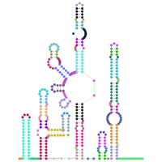
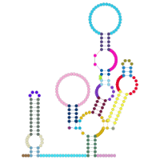

# Rfam for RNArtist

 <!-- -->|<!-- --> |<!-- --> 
:--:|:--:|:--:
 [RF01294](https://rfam.xfam.org/family/RF01294) | [RF01512](https://rfam.xfam.org/family/RF01512)| [RF01852](https://rfam.xfam.org/family/RF01852)
 [RF01999](https://rfam.xfam.org/family/RF01999)| [RF02374](https://rfam.xfam.org/family/RF02374)| [RF02561](https://rfam.xfam.org/family/RF02561)
 [RF02599](https://rfam.xfam.org/family/RF02599)| [RF02762](https://rfam.xfam.org/family/RF02762)| [RF03018](https://rfam.xfam.org/family/RF03018)  

This project provides curated secondary structures for all the RNA families available from [the Rfam database](https://rfam.xfam.org/) (more than 4,000 families in Rfam 14.7). Upcoming updates for this project will provide curated layout for families whose first draft is not satifying.

For each family, you will find two files:
* rnartist.kts: this script provides the instructions to plot the consensus structure of the RNA family. It is written with the [RNArtistCore language](https://github.com/fjossinet/RNArtistCore) and has to be used with the graphical tool [RNArtist](https://github.com/fjossinet/RNArtist) or the library [RNArtistCore](https://github.com/fjossinet/RNArtistCore)
* preview.png: a PNG picture to preview how the consensus structure will look like if you run the script with [RNArtist](https://github.com/fjossinet/RNArtist) or [RNArtistCore](https://github.com/fjossinet/RNArtistCore).

The script rnartist.kts defines the layout and the colors for the consensus structure of the RNA family. A random color has been chosen for each structural domain (helices, junctions). You can modify this script to apply the same layout and colors to a single one or to all RNA species in the family.

## How to use these data?

### With the graphical tool [RNArtist](https://github.com/fjossinet/RNArtist)

In the Script editor, choose "Load Script -> New Script -> 2D from Databases -> Rfam DB". You will be prompted to choose an Rfam ID. RNArtist will then retrieve the last version of the script rnartist.kts stored in this project.

You could also browse and preview all the families interactively from within RNArtist. To do so, you need to:
* [download this project on your computer](https://github.com/fjossinet/Rfam-for-RNArtist/archive/refs/heads/main.zip)
* in the Settings of RNArtist, define the data subdirectory of this project as your "Projects Folder"

### With the library [RNArtistCore](https://github.com/fjossinet/RNArtistCore)

